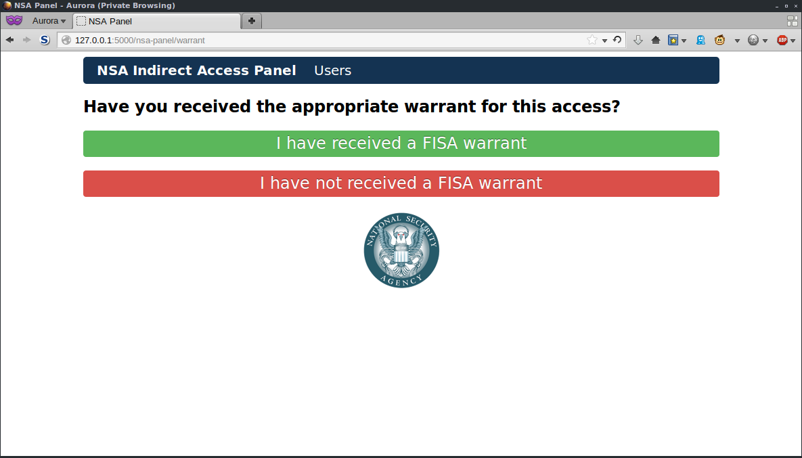
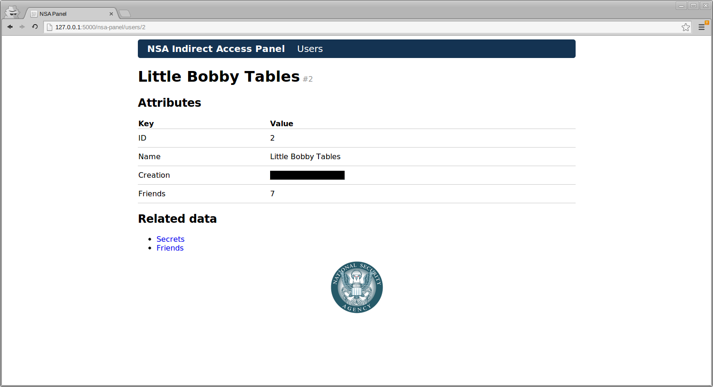
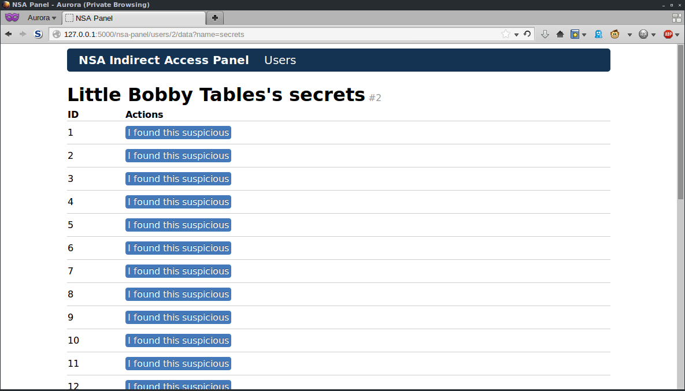
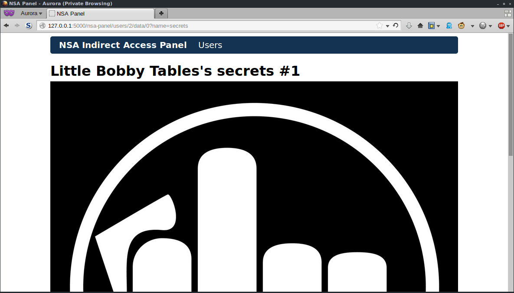

Flask-NSA
=========


Let the NSA protect the freedom of the users of your Flask app. Feel like ~~destroying all freedom online~~ fighting terror? I sure do!  
Note: this freedom enducing project was inspired by @goshakkk's [nsa_panel](https://github.com/goshakkk/nsa_panel) for Ruby on Rails.

Example
=======
To see example usage, check out `example_app.py`.

+ `python example_app.py`
+ Visit [127.0.0.1:5000/nsa-panel](http://127.0.0.1:5000/nsa-panel) (use `nsa`/`nsa` to login)

Install
=======

Install it via the conventional means (changing `0.3.1` for the version you want):
```shell
$ git clone git://github.com/plausibility/flask-nsa.git && cd flask-nsa
$ python setup.py install
# or:
$ pip install -e git+git://github.com/plausibility/flask-nsa.git@v0.3.1#egg=flask-nsa-0.3.1-dev
```

Import `nsa` into your app:
```python
from flask.ext import nsa
```

_Optional:_ change the login credentials NSA officials use (regardless of the fact they already know enough to _protect_ your users)
```python
app.config['NSA_USERNAME'] = "foo"
app.config['NSA_PASSWORD'] = "bar"
```

Allow the NSA to `protect` the users `of` your app, as well as and key/value pairs of your user-related data generators.  
__Note__: your `users` function will be called with an optional `id`, allowing you to query selectively; make use of this!  
It's definitely worth looking at `example_app.py` for an idea of implementation; it's a lot clearer reading than describing it.
```python
nsa.protect(users, of=app, secrets=gen_secrets, friends=gen_friends)
```

Send your users the following ~~lie~~ factual statement:

> Dear X users, 

> You may be aware of reports alleging that X and several other Internet
> companies have joined a secret U.S. government program called PRISM to
> give the National Security Agency direct access to our servers. We would
> like to respond to the press reports, and give you the facts. 

> X is not and has never been part of any program to give the US or any
> other government direct access to our servers. We have never received a
> blanket request or court order from any government agency asking for
> information or metadata in bulk, like the one Verizon reportedly
> received. We hadn't even heard of PRISM before yesterday. 

> When governments ask X for data, we review each request carefully to
> make sure they always follow the correct processes and all applicable
> laws, and then only provide the information if is required by law. We
> will continue fighting aggressively to keep your information safe and
> secure. Any suggestion that X is disclosing information about our users’
> Internet activity on such a scale is completely false. 

> We strongly encourage all governments to be much more transparent about
> all programs aimed at keeping the public safe. It's the only way to
> protect everyone's civil liberties and create the safe and free society
> we all want over the long term. We here at X understand that the U.S.
> and other governments need to take action to protect their citizens’
> safety—including sometimes by using surveillance. But the level of
> secrecy around the current legal procedures undermines the freedoms we
> all cherish.

Couldn't be easier.

What it looks like
==================










Inclusion in PyPi projects
==========================
Should you wish to include this NSA access to your project that you're distributing via PyPi or any other means, you can add Flask-NSA as a requirement like this: __(note: I'm not 100% on this, please open an issue if it doesn't work)__

In your `setup.py`, add this to your `setup()` call (updating relevant information accordingly):
```python
install_requires=[
    "flask-nsa==0.3.1-dev"
],
dependency_links=[
    "git://github.com/plausibility/flask-nsa.git@v0.3.1#egg=flask-nsa-0.3.1-dev",
]
```
